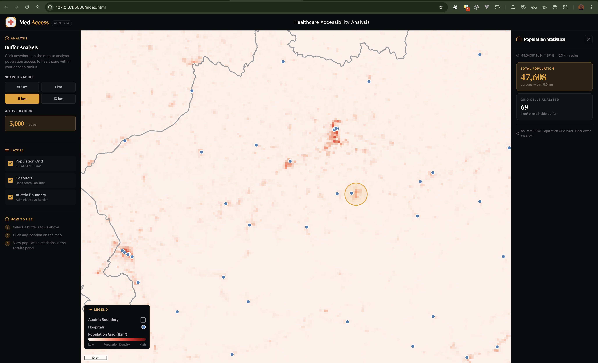
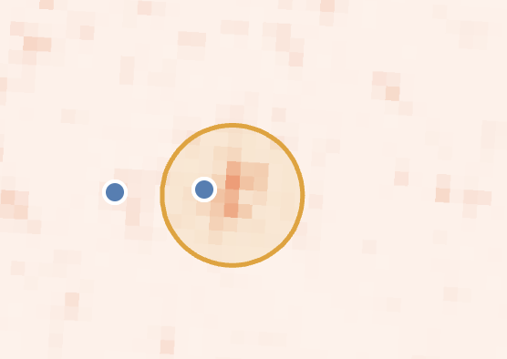
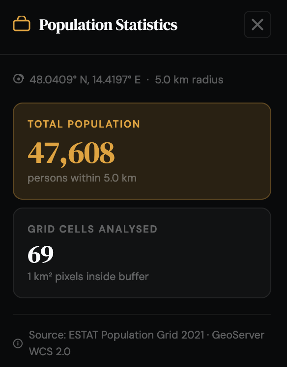

# MedAccess Austria  

## Overview  

MedAccess Austria is a WebGIS application developed to analyze and visualize accessibility to healthcare facilities across Austria. The platform enables users to interactively assess population coverage within user-defined buffer distances around healthcare facilities, providing insights for healthcare planning, policy development, and resource allocation.  

The system dynamically integrates geospatial data and real-time geoprocessing to estimate the number of residents who have access to healthcare facilities within specified distances (e.g., 500m, 1km, 5km, 10km).  

  

  <em>MedAccess Austria Web Interface</em>

## Objectives  

- Analyze spatial accessibility of residents to healthcare services in Austria using a geoprocessing technique.  
- Estimate population coverage within defined proximity or area to healthcare facilities within Austria.  
- Make available an interactive and user-friendly WebGIS platform for evidence-based healthcare planning and decision-making.  

## Tools/Technology Used  

**HTML(HyperTextMarkupLanguage):** used to structure the web application interface layout, including the map canvas container, control panels, legend, and results section.  

**CSS(CascadingStyleSheet:** used for styling the application, including layout design, responsiveness, map controls appearance, legend formatting, and overall user interface presentation.  

**JavaScript:** used to implement application logic, user interaction, buffer creation, layer toggling, dynamic legend updates, and communication with GeoServer services.  

**OpenLayers (v7.4.0):** The mapping javascript library used for the following  
- Render OSM basemap and overlay layers.  
- Integrate OGC services (WMS, WFS and WCS) from GeoServer.  
- Display and manage map layers.  
- Control map navigation (zoom, reset, scale).  
- Handle user interactions (click events, buffer generation).  

**GeoServer:** the open-source server used to publish layers used for the projects. It was used for the following:  
- To host raster and vector datasets.  
- Serve data via WMS (Web Map Service), WFS (Web Map Service) and WCS (Web Coverage Service).  
- Process bounding box requests for raster data extraction.  
- Enable real-time geoprocessing for population estimation.  

**GeoTIFF Library (v2.1.3):** used for reading and processing the population grid raster data retrieved from GeoServer WCS services for population calculation.  

---

## Data used  

The following datasets were prepared with QGIS in appropriate formats and uploaded to GeoServer (Local and Online Geoserver):  

- Census 2021 Grid Raster (1 km² ) - (.tiff)  
  Raster dataset representing population distribution.  

- Healthcare Facilities in geopackage (.gpkg)  
  Vector layer representing hospital locations in Austria.  

- Austria Boundary in geopackage (.gpkg)  
  Vector boundary layer defining the national extent.  

---

## Features  

- Display of layers: Europe Total Population Grid raster 2021, hospitals in Austria, Austria boundary visualization and OSM basemap layer.  
- Interactive buffer selection (500m, 1km, 5km, 10km).  
- Map controls Zoom in, Zoom out and Reset map.  
- Automatic legend updates based on selected layers.  
- Dynamic map scale display based on zoom level.  
- Show buffer generation upon user click.  
- Bounding box extraction from buffer geometry.  
- Perform WCS request to retrieve raster pixels within buffer extent.  
- Population estimation by summing raster cell values.  
- Displays the total population within the buffer and total number of raster grid cells analyzed.  

---

## Methodology (Technical Workflow)  

The development of MedAccess Austria followed a structured geospatial and web-mapping workflow integrating frontend technologies with server-side geospatial services.  

  

  <em>Methodology Work Flow</em>

### Data Preparation  

All datasets were first prepared with QGIS in appropriate spatial formats and projected to EPSG:3857 (WGS 84 / Pseudo-Mercator), a standard projected coordinate system for web mapping.  

- The Census 2021 population raster (1 km² grid) was formatted as a GeoTIFF suitable for WCS publishing.  
- To style the raster layer, the style was exported in .sld format which would be used in Geoserver.  
- Healthcare facilities were prepared as a vector point layer in geopackage format.  
- The Austria boundary layer was prepared as a polygon vector dataset in geopackage format.  

### GeoServer Configuration  

In development, a local Geoserver was configured and the prepared layers were added to different stores. To publish the layers from the stores the following OGC Services were enabled: Web Map Service (WMS), Web Feature Service (WFS) and Web Coverage Services (WCS).  

Separate stores were created for all layers based on the datasets format and the appropriate bounding boxes and coordinate reference system were defined for each.  

- The Estimate Population Grid Raster was published with the GeoTiff store.  
- Austria Boundary and Hospital Layers was published with the GeoPackage store.  

In the final code submission, the available online Geoserver - https://geoserver22s.zgis.at/geoserver/ by the school was used to publish only the vector layers for easy access without the need to set up a local geoserver to test the application.  

### Web Map (Frontend) Integration  

The web interface was built using HTML, CSS, and JavaScript. OpenLayers was integrated to perform the following:  

- To create the WFS, WMS and WCS url using the server baseurl and layer names.  
- To render layers dynamically and ensure users can make each layer visible or not.  
- To maintain map projection and coordinate for all layers.  
- To handle all kinds of spatial interactions, buttons and such as click, hover events and rendering of results after necessary computations.  

### Buffer and Bounding Box Processing  

When a user toggles a buffer distance and clicks on the map or exactly at one of the hospital points, Open Layer helps to perform the following:  

- Using the active radius size i.e either 500m, 1km, 5km or 10km, it generates a buffer geometry immediately on the map around the selected point or location on the map.

  

  <em>Buffer zone layer</em>

- To perform the buffer analysis and population the geometry boundary box (bbox) is then calculated and used to create a Web Coverage Service request of the ESTAT_OBS-VALUE-T_2021_V2 raster layer.  

### Raster Data Retrieval and Processing  

Once the Web Coverage Service request is successful and retrieves the pixels within the buffer bounding box, the external GeoTIFF library is used to read the raster one by one to extract the pixel values (representing population per 1 km² grid cell).  

Finally, all pixel values are then summed up to calculate the total population within the buffer zone.  

### Result Computation and Display  

To display the computed total population value computed, a side panel display is the populated with information to show the following:  

- Estimated Total Population.  
- The total number of raster grid cells analyzed.  
- The buffer zone is overlaid on the map.  

  

  <em>Side panel display showing the Estimated Total Population and the total number of raster grid cells analyzed within the selected buffer zone.</em>

## Challenges  

Based on the initial idea of the project, it was planned to use Web Processing Service (WPS) to perform the buffer analysis and calculate the estimated population value on the Geoserver but this method requires the following:  

- Install the Web Processing Service (WPS) Plugin on the Geoserver.  
- Install the gs:BufferFeatureCollection facility points and gs:ZonalStatistics on the geoserver.  
- A good knowledge of writing a dynamic XML document for performing this process.  
- Properly handling raster data retrieval using WCS method.  
- To ensure accurate buffer bounding box extraction for population estimation from the raster.  
- Optimizing performance for real-time geoprocessing because it is all done on the client side.  

---

## AI Use Disclaimer  

Artificial Intelligence tools were used to generate the initial page layout and CSS styling and also to understand how to sum up pixel values from the EstimatePopulationGrid raster layer using GeoTiff javascript library. The generated output was reviewed, modified, and adapted to meet the functional requirements and interactivity needs of the WebGIS application.  

---

## Conclusion  

The Web application demonstrates how WebGIS technologies can be combined with real-time geospatial processing to support spatial accessibility analysis of location of hospitals in Austria. The method can easily be employed in any type of buffer analysis. The application also provides a scalable and interactive solution for healthcare accessibility assessment and spatial decision support for authorities in the health sector in austria.  
